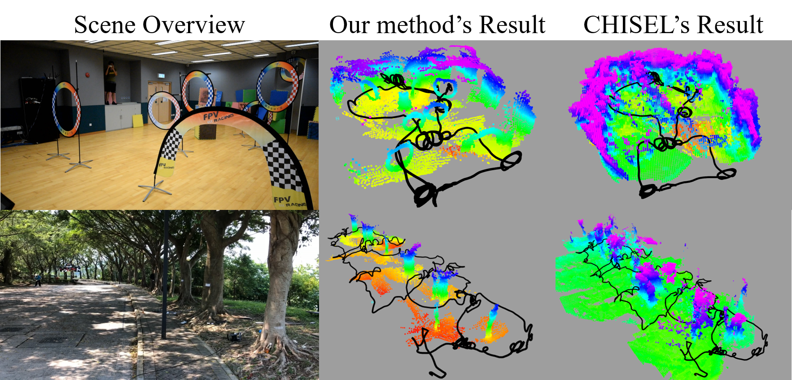
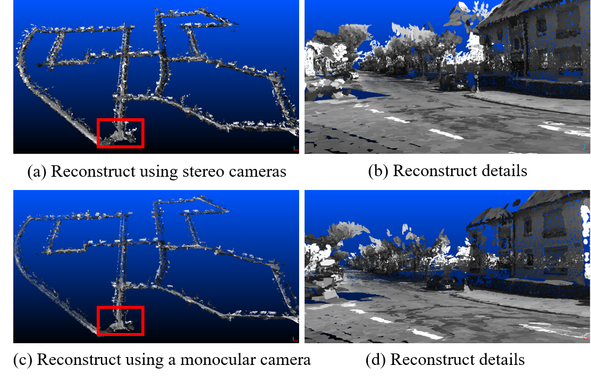

# DenseSurfelMapping
## A depth map fusion method

This is a depth map fusion method following the ICRA 2019 submission **Real-time Scalable Dense Surfel Mapping**, Kaixuan Wang, Fei Gao, and Shaojie Shen. The code will be released when the paper is accepted.

Given a sequence of depth images, intensity images, and camera poses, the proposed methods can fuse them into a globally consistent model using surfel representation. The fusion method supports both [ORB-SLAM2](https://github.com/raulmur/ORB_SLAM2) and [VINS-Mono](https://github.com/HKUST-Aerial-Robotics/VINS-Mono) (a little modification is required) so that you can use it in RGB-D, stereo, or visual-inertial cases according to your setups. We develop the method based on the motivation that the fusion method: (1) can support loop closure (so that it can be consistent with other state-of-the-art SLAM methods),  (2) do not repuire much CPU/memory resources to reconstruct a fine model in real-time, (3) can be scaled to large environments. 

An example to show the usage of the surfel mapping is shown below.

Left is the overview of the environment, middle is the reconstructed results (visualized as point clouds in rviz of ROS) of our method, and right is the result using [OpenChisel](https://github.com/personalrobotics/OpenChisel). We use VINS-Mono to track the camera motion with loop closure, and [MVDepthNet](https://github.com/HKUST-Aerial-Robotics/MVDepthNet) to estimate the depth maps. Black line is the path of the camera. In the reconstruction, loop clusure is enabled to correct the detected drift. OpenChisel is a great project to reconstruct the environt using the truncated signed distance function (TSDF). However, as shown in the example, it is not suitable to be used with SLAM systems that have loop closure abilities.

The system can also be applied to the KITTI datasets in real-time with only CPU computation.

The top row is the reconstruction using stereo cameras and the bottom row is the reconstruction using **only the left camera**. Details can be found in the paper.

A video can be used to illustrate the performance of the system and how we apply it into an autonomous navigation:

