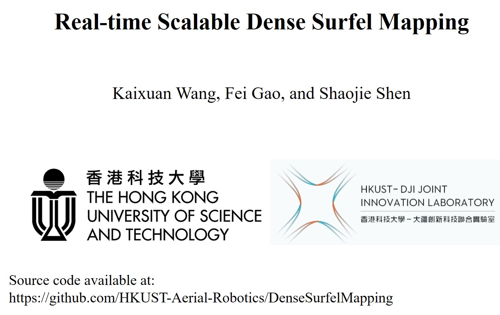

# DenseSurfelMapping
## A depth map fusion method

This is a depth map fusion method following the ICRA 2019 submission **Real-time Scalable Dense Surfel Mapping**, Kaixuan Wang, Fei Gao, and Shaojie Shen.

Given a sequence of depth images, intensity images, and camera poses, the proposed methods can fuse them into a globally consistent model using surfel representation. The fusion method supports both [ORB-SLAM2](https://github.com/raulmur/ORB_SLAM2) and [VINS-Mono](https://github.com/HKUST-Aerial-Robotics/VINS-Mono) (a little modification is required) so that you can use it in RGB-D, stereo, or visual-inertial cases according to your setups. We develop the method based on the motivation that the fusion method: (1) can support loop closure (so that it can be consistent with other state-of-the-art SLAM methods),  (2) do not require much CPU/memory resources to reconstruct a fine model in real-time, (3) can be scaled to large environments. 

An example to show the usage of the surfel mapping is shown below.

<p align="center">

</p>

Left is the overview of the environment, the middle is the reconstructed results (visualized as point clouds in rviz of ROS) of our method, and right is the result using [OpenChisel](https://github.com/personalrobotics/OpenChisel). We use VINS-Mono to track the camera motion with loop closure, and [MVDepthNet](https://github.com/HKUST-Aerial-Robotics/MVDepthNet) to estimate the depth maps. The black line is the path of the camera. In the reconstruction, loop closure is enabled to correct the detected drift. OpenChisel is a great project to reconstruct the environment using the truncated signed distance function (TSDF). However, as shown in the example, it is not suitable to be used with SLAM systems that have loop closure abilities.

The system can also be applied to the KITTI datasets in real-time with only CPU computation.

<p align="center">

</p>

The top row is the reconstruction using stereo cameras and the bottom row is the reconstruction using **only the left camera**. Details can be found in the paper.

A video can be used to illustrate the performance of the system and how we apply it into an autonomous navigation:
<p align="center">
<a href="https://youtu.be/2gZNpFE_yI4" target="_blank"></a>
</p>

# Software

The open-sourced surfel fusion system is used for reconstructing the KITTI dataset using ORB_SLAM2. For VINS-MONO, we are using it in a teach-and-repeat project and will opensource lately. This project consists of three parts: the surfel_fusion, a modified ORB_SLAM2, and a kitti publisher.

## ORB_SLAM2
The ORB_SLAM2 is from the original [one](https://github.com/raulmur/ORB_SLAM2) and is modified to publish necessary information. You may install the ORB_SLAM2 following the original instructions.

## Surfel_fusion
Surfel_fusion can be installed in ros catkin workspace by 
```
catkin_make
```

## Kitti publisher
kitti publisher is a simple python warper to publish the Kitti dataset along with the pre-calculated depth maps (using [PSMNet](https://github.com/JiaRenChang/PSMNet)).

# Data

Here, we provide sequence 00 from the kitti dataset so that you can easily run the code. You can download the dataset from [this_link](https://www.dropbox.com/s/qpn40yt8bjvkapd/kitti_sequence_00.tar.gz?dl=0).

# Run the code
If you have installed all three components from the software

1. change line 23 in ./kitti_publisher/scripts/publisher.py according to your downloaded dataset path.

2. change the path ```/home/wang/software/ORB_SLAM2/Vocabulary/ORBvoc.txt``` and ```/home/wang/software/ORB_SLAM2/Examples/Stereo/KITTI00-02.yaml``` according to your environment in /ORB_SLAM2/orb_kitti_launch.sh.

3. open four terminal windows: run the ORB_SLAM2 by

```
./orb_kitti_launch.sh 
```

, run the surfel fusion by

```
roslaunch surfel_fusion kitti_orb.launch
```

, and run the kitti publisher by

```
rosrun kitti_publisher publisher.py
```

, and run the rviz by

```
rviz
```
(you can load the rviz_config.rviz in the project to load published messages).

4. the kitti publisher will initialize a window and you can start the publish by press any key on that window. Press ***Esc*** will quit the publisher.

# Save the result
The code also support saving the reconstructed model by changing line 22 in /surfel_fusion/launch/kitti_orb.launch. Just press crtl+c on surfel fusion will cause the software to save meshes into the defined the path and quit the process.