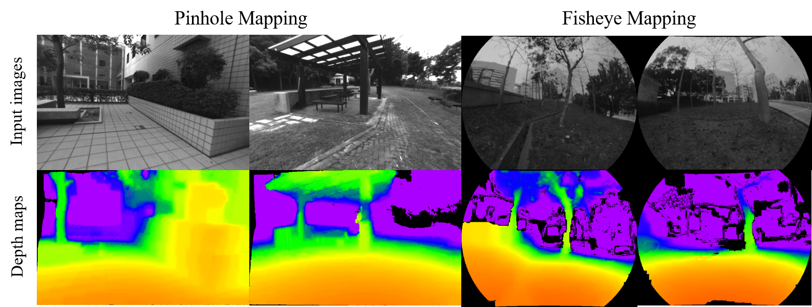

# Pinhole-Fisheye-Mapping
## A monocular dense mapping system for pinhole and fisheye cameras

Please go to ```fisheye_mapping``` branch for fisheye application and go to ```pinhole_mapping``` branch for pinhole application.

This is a monocular dense mapping system following the IROS 2018 submission **Adaptive Baseline Monocular Dense Mapping with Inter-frame Depth Propagation**, Kaixuan Wang, Shaojie Shen. The implementation will be open source after the acceptance of the paper.

Benefiting from the proposed adaptive baseline matching cost computation, belief propagation based depth extraction and depth refinement using inter-frame propagated depth filter, our system can generate high-quality depth maps in real-time using a pinhole or a fisheye camera.

An example of the system output is shown:



A video can be used to illustrate the pipeline and the performance of our system:

<a href="https://youtu.be/sjxMjsl-fD4" target="_blank"></a>